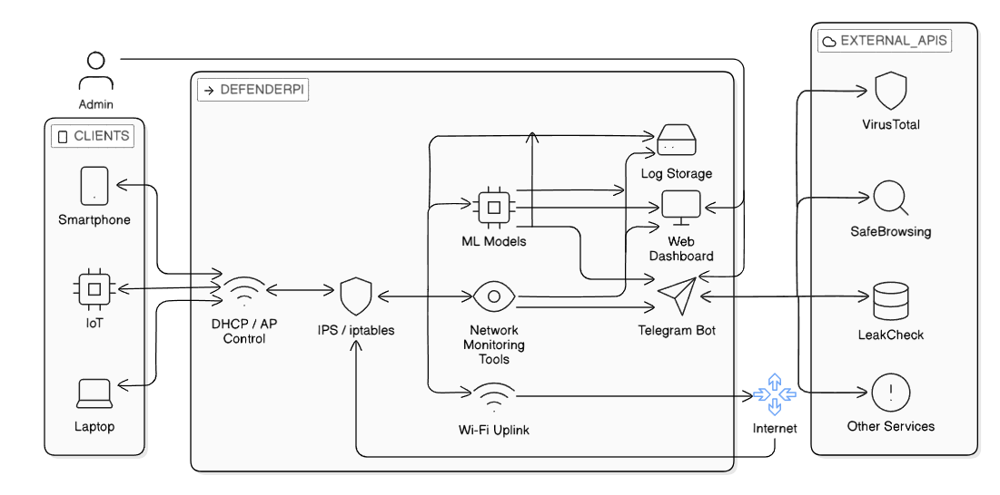
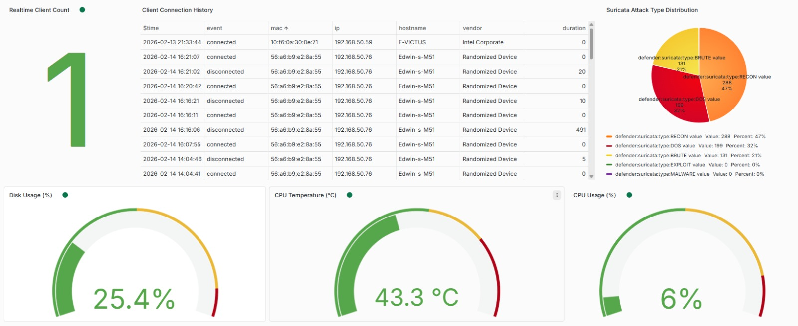
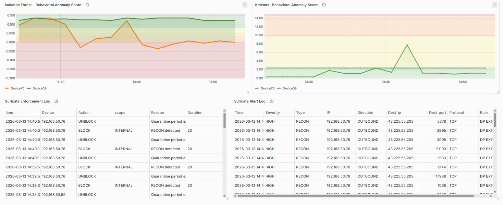
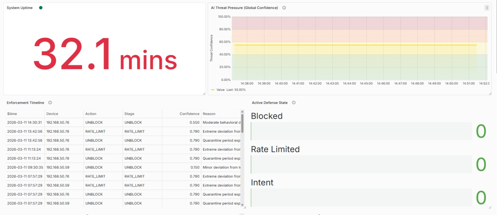
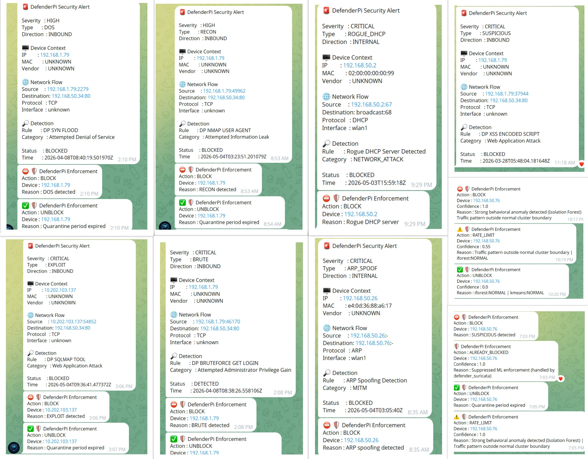

# DefenderPi

### AI Assisted Inline Network Defense System for Small and Edge Networks Using Raspberry Pi.docx

DefenderPi is an edge-based cybersecurity platform that combines intrusion prevention, DNS security, behavioral analytics, threat intelligence, and automated response into a single Raspberry Pi deployment.

Built to demonstrate practical cybersecurity engineering skills, DefenderPi provides real-time threat detection, network visibility, automated containment, and SOC-style monitoring within a low-cost edge security appliance.

---

## Key Features

* Inline Intrusion Prevention System (Suricata IPS)
* Rogue DHCP Server Detection
* ARP Spoofing Detection
* DNS Security with Pi-hole and Unbound
* Machine Learning–Based Behavioral Analytics
* Reputation-Based Enforcement Escalation
* Automated Threat Containment
* Threat Intelligence Integration
* Telegram Security Alerting
* Grafana Security Monitoring Dashboard

---

## Architecture

```text
Client Devices
       │
       ▼
Wireless Access Point
       │
       ▼
Suricata IPS
       │
       ▼
Detection Layer
 ├─ DHCP Detection
 ├─ ARP Detection
 ├─ DNS Security
 └─ ML Analytics
       │
       ▼
Policy Engine
       │
       ▼
Enforcement Controller
       │
       ▼
Reputation Engine
       │
       ▼
Automated Containment
       │
       ▼
Internet
```

---

## Key Outcomes

* Built a deployable network security gateway on Raspberry Pi 4
* Implemented real-time threat detection and automated response workflows
* Developed custom DHCP and ARP attack detection modules
* Integrated machine learning–based anomaly detection using Isolation Forest and K-Means
* Designed a centralized policy, enforcement, and escalation architecture
* Automated containment using iptables, ipset, and conntrack
* Integrated external threat intelligence sources for enhanced decision-making
* Developed SOC-style monitoring, alerting, and incident response capabilities

---

## Technology Stack

| Category     | Technologies                                     |
| ------------ | ------------------------------------------------ |
| Hardware     | Raspberry Pi 4 (4GB), TP-Link Archer T2U Plus    |
| Security     | Suricata, Pi-hole, Unbound, arpwatch, Scapy      |
| Networking   | hostapd, dnsmasq, iptables, ipset, conntrack     |
| Monitoring   | Grafana, Redis                                   |
| Development  | Python, Bash, systemd                            |
| Integrations | Telegram Bot API, VirusTotal, AbuseIPDB, URLhaus |

---

## Performance

| Metric             | Result      |
| ------------------ | ----------- |
| Detection Latency  | 0.59–1.32 s |
| Containment Time   | 0.63–1.40 s |
| CPU Utilization    | 12–18%      |
| Memory Utilization | <650 MB     |
| Deployment Cost    | ~₹7700      |

---

## Screenshots

### System Architecture


## Security Dashboard


### Threat Detection Analytics


## Active Defense & Automated Response


### Telegram Security Alerts



---

## Project Focus

**Security Engineering • Threat Detection • Intrusion Prevention • Incident Response • Network Security • Security Automation • SOC Operations • Machine Learning for Cybersecurity**
